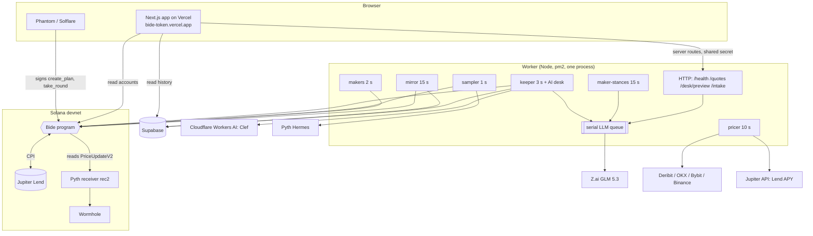
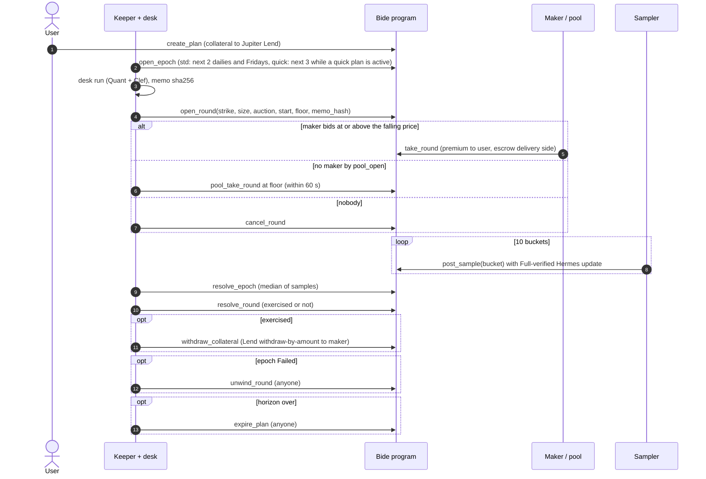

# Bide architecture

This document describes how Bide works as built on 6 Oct 2026. It is checked against the code in `programs/`, `worker/`, `app/`, `packages/shared/` and `supabase/migrations/`, and against the devnet logs in `notes/`. Items marked "(unverified)" could not be checked from the repo.

## 1. System overview

- **App:** Next.js on Vercel, root directory `app/`. It reads accounts from devnet RPC and history from Supabase. It builds and signs user transactions in the browser.
- **Worker:** one Node process under pm2 on an ECS VM. Public URL `https://bide-worker.47.250.173.246.sslip.io` (`/health` answered `ok: true, repo: supabase, chain: live` on 6 Oct 14:45 UTC). It binds to the address in `HOST` (default `127.0.0.1`; on the VM, the Docker bridge IP) so only the reverse proxy can reach it. The proxy is the VM's existing Traefik (Coolify) with one added route file: `bide-worker.47.250.173.246.sslip.io` → `http://10.0.1.1:8787`, Let's Encrypt TLS (verified 6 Oct: HTTPS `/health` 200, `/desk/preview` without the secret 401). `/desk/preview` and `/intake` require `WORKER_SHARED_SECRET` (constant-time compare, fails closed when unset).
- **Chain:** the Bide program on devnet, which calls Jupiter Lend and reads Pyth price accounts verified through Wormhole.

## 2. On-chain program

Program `4bwTwLAZqPMLSbdvQQ9UrePJiRBUKgiA8TKV3ydo4tqe`, Anchor 1.0.2, Rust 1.89. Last upgrade (with the security-review fixes) at slot 507875135, checked from the programdata account. Source: `programs/bide/src/`.

### Accounts

| Account | Seeds | Key fields |
|---|---|---|
| Config | `["config"]` | admin, agent (keeper key allowed to open rounds), paused, fee_bps (default 1000 = 10%, cap 2000), fee_recipient |
| Asset | `["asset", mint]` | pyth_feed_id, spot_feed (pinned push-feed account), lend_f_token_mint, strike_tick (SOL $0.10), max_conf_bps, max_spot_move_bps, max_spot_age_secs (devnet 300), enabled |
| Plan | `["plan", owner, nonce u64 LE]` | side (Buy / Sell / Wheel), phase, quick, strike band (put and call), size_total / size_filled, collateral_principal, lend_shares, min_premium_bps_per_day, max_expiry_secs, horizon_end, max_rounds_per_day, active_round, pending_settlement, status |
| Round | `["round", plan, round_index u32 LE]` | kind (Put / Call), strike, size, notional, epoch, auction_start, auction_secs, pool_delay_secs, premium_start, premium_floor, spot_at_open, maker, maker_is_pool, premium_paid, fee_paid, settle_price, exercised, **memo_hash [u8; 32]**, status |
| Epoch | `["epoch", asset, kind u8, expiry i64 LE]` | kind (Std / Quick), n_buckets, bucket_secs, bucket_tolerance_secs, grace_secs, samples[10], sample_mask, settle_price, status (Open / Sampling / Resolved / Failed) |
| Pool | `["pool"]` | authority, caps (premium bps of notional, open notional, utilisation, spend window), share_mint, lend_shares, reserved_usdc / reserved_wsol, open_notional |

Other PDAs: `["escrow", round]` (round escrow token account, authority = Round PDA), `["pool_mint"]` (LP share mint), and `["lend_auth", plan]` / `["lend_auth", pool]`. The `lend_auth` PDAs hold no data and no lamports. They own every plan and pool token account and sign the Jupiter Lend CPIs.

### Instructions (28)

| Group | Instructions |
|---|---|
| Admin | `init_config`, `add_asset`, `update_asset`, `rotate_agent`, `set_paused`, `set_fee` |
| Plan | `create_plan`, `update_plan`, `pause_plan`, `flip_plan`, `close_plan`, `expire_plan` |
| Round | `open_round` (agent only), `take_round`, `pool_take_round`, `cancel_round` |
| Settlement | `open_epoch`, `post_sample`, `resolve_epoch`, `resolve_round`, `withdraw_collateral`, `unwind_round` |
| Pool | `init_pool`, `pool_deposit`, `pool_withdraw`, `pool_lend_idle`, `pool_unlend`, `set_pool_params` |

### What `open_round` enforces

The agent key can propose anything; `open_round` (`instructions/round.rs`) rejects it unless:

- config not paused, asset enabled, plan Active and unpaused, no active round, no pending settlement;
- strike on the asset tick and inside the plan's band (puts at or below target, calls at or above);
- `0 < size ≤ size_total − size_filled`;
- epoch Open and of the plan's kind; `now < expiry ≤ min(now + max_expiry_secs, horizon_end)`; std epochs at least 12 h away;
- time window: std 08:00–08:30 UTC; quick `[expiry − 600, expiry − 540]`;
- auction length: std 10–1800 s, quick 5–120 s; auction plus pool delay must end before sampling starts;
- `rounds_today < max_rounds_per_day`;
- `0 < floor ≤ start ≤ 3 × floor`; notional ≥ 1 USDC;
- minimum yield after fee: `floor × (1 − fee) ≥ notional × min_bps_per_day × days_to_expiry` (`math::premium_meets_min`);
- spot from the pinned push feed: right account, Full verification, not older than `max_spot_age_secs`, confidence within `max_conf_bps`.

`take_round` and `pool_take_round` re-read spot and reject if it moved more than `max_spot_move_bps` from `spot_at_open`.

### Money flow

- `create_plan`: USDC (buy) or WSOL (sell) moves into a plan vault and is deposited into Jupiter Lend. The deposit is principal + 10 base units (dust buffer, see below).
- `take_round`: the maker pays the current auction price. `fee_bps` of it goes to the fee recipient; the rest goes to the plan owner at once. The maker escrows the delivery side: `size` WSOL for a put, `strike × size` USDC for a call.
- `resolve_round`: if exercised, the escrow goes to the owner (SOL at the strike for a put, USDC for a call) and the plan records a pending settlement. If not, the escrow goes back to the maker. Collateral stays in Lend.
- `withdraw_collateral`: pays the maker from the plan's Lend position by **withdraw-by-amount**, so the maker receives exactly `strike × size` USDC (put) or `size` WSOL (call).
- Bide is never the counterparty. Its only income is the on-chain fee.

### Permissionless exits

`post_sample`, `resolve_epoch`, `resolve_round`, `withdraw_collateral` (retryable), `unwind_round` (epoch Failed), and `expire_plan` (after `horizon_end`) need no special key. `cancel_round` is open to the owner during the auction, to the agent once the pool window opens, and to anyone 60 s after that. No state depends on the keeper staying alive.

### Jupiter Lend integration

- The CPI is hand-built from the IDLs with devnet ids (lending `7tjE28iz…`, liquidity `5uDkCoM9…`), because the SDK only knows mainnet. Lend accounts arrive as remaining accounts, 13 per market, through lookup table `CEqxacEbFQ2oCJNWtPqQwYBWiyrwsiTakMN786efPoaT`.
- `update_rate` runs first, then deposit, redeem or withdraw-by-amount.
- Withdraw-by-amount burns shares rounded up, which left the maker 1 base unit short in tests. Fix: `create_plan` deposits 10 extra base units (`LEND_DUST_BUFFER`). If the position is still short, the program pays `min(owed, received)` instead of failing forever.
- Lend rejects tiny operations (`OperateAmountsNearlyZero`). Positions under 1,000 base units are left as dust on close.
- Finding: deployed devnet Lend requires `liquidity_program` to be **writable** in deposit, although its IDL marks it read-only.

### Security review fixes (deployed)

From a Fable 5.1 review on 5 Oct; regression tests in `tests/src/review-fixes.test.ts`, each also run against the pre-fix build:

1. A token donated into an escrow blocked `cancel_round`. Now the escrow is swept to the plan owner, then closed.
2. `pool_take_round` had no deadline. Now it needs an Open epoch, `now` before sampling, and at most 60 s after the pool window opens.
3. Tiny rounds could brick `withdraw_collateral` on Lend's minimum. Now `open_round` rejects notional < 1 USDC (`RoundTooSmall`), and withdraw takes at least Lend's minimum but pays only what is owed.
4. Pool NAV had a hole between resolve and withdraw. An exercised pool round now books a receivable.
5. Closing a Wheel plan could strand delivered SOL. The asset vault is now required.
6. Pool first-depositor inflation: virtual shares and assets of 1,000. The test attacker loses instead of gaining.

## 3. Round lifecycle

Timing per epoch kind (from `constants.rs`):

| | Std | Quick |
|---|---|---|
| Expiry | 08:00 UTC | every 10 minutes |
| Open window | 08:00–08:30 UTC, for epochs ≥ 12 h away | `[E − 600, E − 540]` |
| Auction length | 10–1800 s (worker default 300) | 5–120 s (worker default 30) |
| Pool delay | 60 s | 10 s |
| Sampling | 10 × 180 s buckets, last 30 min before expiry | 10 × 10 s buckets, last 100 s |
| Bucket tolerance | 10 s | 2 s |
| Grace | 3600 s | 120 s |

The auction price falls linearly from start to floor over `auction_secs` and stays at the floor until `pool_open = auction_start + auction_secs + pool_delay`. Makers can take until `pool_open`. The pool can take in `[pool_open, pool_open + 60]`.

## 4. Pricing engine

Code: `worker/src/pricer/`. The pricer refreshes every 10 s.

1. **Quotes.** Public option APIs of Deribit, OKX, Bybit and Binance, no keys. Deribit has no bid/ask IV in its book summary, so bid/ask IV is implied from its bid/ask prices (Black-76). Binance's forward is its index (r = 0).
2. **Filters** (`surface.ts`): drop quotes older than 30 s, with no bid or ask, with ask IV below bid IV, or with a spread over 10 vol points.
3. **Per-venue IV:** linear in log-moneyness within an expiry, using the OTM side per strike; linear in total variance across expiries; no extrapolation.
4. **Consensus** (`consensus.ts`): fair IV = median of venue mid IVs, bid IV = median of venue bid IVs, at least 2 venues.
5. **Black-Scholes** with r = 0 on Pyth spot gives fair and bid premiums for the round's size.
6. **Anchors:** start = ⌈1.3 × fair⌉, floor = ⌈0.9 × bid⌉. Then clamp: floor ≤ fair; if start > 3 × floor, lower start to 3 × floor; only if that puts start below fair, raise floor to ⌈fair / 3⌉ (flagged `floorRaised`).
7. **Quick plans.** No venue lists 10-minute options. A quick round uses the nearest listed expiry's IV (flat) and is flagged `quick_pricing`. It is valued as of `max(now, E − 600)`, the auction-window open, not the desk's start time. Before this fix (commit `8fbb25e`), the desk priced about 3 minutes of extra time value, which put the floor above the makers' fair at take time.
8. **Fill probability** comes from the same model and is shown to the desk and the user.

The 1.3 and 0.9 multipliers are judgment calls, not calibrated.

## 5. Oracle and settlement

- **Samples** come from mainnet Hermes (`hermes.pyth.network`). Its VAAs are signed by guardian set 1, which devnet Wormhole also holds, so they verify **Full** on the devnet receiver `rec2HHDDnjLfj4kE7VyEtFA1HPGQLK33259532cRyHp` (`notes/oracle.md`).
- **Two transactions per sample** (the full flow is 1,311 B, over the 1,232 B limit): tx A writes the encoded VAA; tx B runs `verify_encoded_vaa`, `post_update`, `post_sample`, then closes both accounts to reclaim rent (about 109k CU in tests). The receiver instructions are built by hand (`worker/src/pyth/post.ts`), because the Pyth JS SDK 0.16 fails to load under Node 25.
- **Bucket rule** (`settle.rs`): a sample for bucket *i* is accepted only if `prev_publish_time < bucket_start ≤ publish_time ≤ bucket_start + tolerance`. Hermes publishes once per second with no gaps, so exactly one update qualifies: the first at or after the bucket start. Anyone can post; nobody can choose among prints. The receiver does no age check, so this window is the only replay defence.
- **Sampler** posts each bucket at `bucket_start + 2 s`, up to 6 posts at once, and retries confidence failures within the tolerance.
- **Resolve:** with all 10 samples, any time after expiry. With 8 or 9, after `expiry + grace`. Fewer than 8 after grace → the epoch is **Failed** and anyone can call `unwind_round`, which returns the escrow and leaves collateral in Lend. Settlement price = median of the filled samples.
- **Auction spot** (open, take, pool take, pool deposit) reads the sponsored push feed `7AviUf9nL62mcxNbQGKm4nKDQnPjswo6c5MX4D57HmyE`, pinned per asset. Makers never have to post VAAs. The devnet feed updates about once a minute but had gaps of 227 s and 320 s, so devnet allows 300 s.

## 6. AI layer

All LLM calls go through one serial queue (`worker/src/agents/queue.ts`). Priorities: keeper desk 0, maker stances 1, public previews and intake 2. The public lane allows 1 call in flight and a bounded backlog; overflow returns HTTP 429. Keeper desk runs are also serialised among themselves, so with several quick plans the first one always makes its window. Clef calls do not use the queue.

### Intake (`agents/intake.ts`)

- Input: up to 600 characters of free text. Output: draft form fields, assumptions, questions. `POST /intake` returns 202 and the app polls.
- The model copies a relative target as a signed percentage. Code converts it to a dollar price from live spot and snaps it to the $0.10 tick (buys down, sells up).
- Every field is re-validated in code: buy below spot, sell above, 0.4–2.5× spot, caps, deadline 2–179 days, SOL only. A bad value is cleared and turned into a question. An assumption about a rejected deadline is dropped.
- The user still reviews the normal form and signs. Intake text is stored in `intake_runs`, which has no public read.

### Quant (`desk/quant.ts`, `desk/tools.ts`)

- GLM 5.3 with tool calling, at most 8 tool rounds, then one final turn. Nine tools: `get_plan`, `get_spot`, `price_grid`, `fill_probability`, `lend_apy`, `venue_dispersion`, `spot_moves`, `recent_outcomes`, `event_calendar`.
- Output: `open` / `skip` / `flip` / `stop`, with expiry, size (ladder: all, ½, ⅓ of remainder), auction length, start and floor. zod checks types and ranges only, never plan bounds; one repair turn on invalid output.
- The tools pre-compute every number (days to expiry, notional, the user-minimum floor, USD strings), so the model copies rather than calculates. A provenance check records whether each proposed number appears in a tool output.
- `recent_outcomes` is deterministic, not an LLM: fill rate, paid ÷ start, seconds to fill, untaken, pool takes, exercise rate, last 5 rounds. The Quant must cite it. It may inform auction length, expiry, size and skip, never limits or premiums. LLM "reflection" memory was cut.
- Quick plans are offered only the one epoch whose window is open or opens within the 180 s desk lead.

### Risk (`desk/risk/`)

- Cloudflare Clef on Workers AI (default `RISK_BACKEND=workers-ai`), GLM fallback with the same questions. If every backend fails, the desk fails closed.
- Five questions: `verdict` (approve / adjust / veto), `event_risk` (none–high), `data_quality` (poor–good), `user_fit` (matches / too_aggressive / too_passive), `explanation_ok` (rationale matches the numbers).
- Binding: argmax verdict, ties go to the more conservative one. Veto → nothing is sent. Adjust → one Quant retry with the top concern, judged again. Risk only runs for `open`.
- The Risk state is built from a whitelist: proposal, spot, the matching price cell, fill probability, dispersion, moves, Lend APY, events, the user's stated patience. It excludes strike range, minimum yield, max expiry, horizon, remaining size and rate limits.
- The Quant's free-text rationale could leak bounds. `scrubRationale` redacts bound values and user-minimum phrases **in place**. An earlier version withheld whole rationales, and Clef then vetoed 13 of 16 of those with "rationale does not match" (`notes/stress-test.md`, test 6).

### Submission and the on-chain referee

- The keeper sends the proposal to `open_round` as-is with `skipPreflight`, so a rejection is a real failed transaction with an error code.
- On a program rejection, the desk gets exactly one retry with the error name.
- Transient send failures (blockhash expiry, RPC timeout) retry the same memo up to 4 times while the window is open.
- If the desk finishes after the window, the run is recorded off-chain as `WindowMissed` and not sent. `/desk` counts only landed program errors as rejections.

### Memo

`{inputs, quant_proposal[], clef_answers[], final, tool_traces, model_ids, timestamps, provenance}` is serialised as canonical JSON (sorted keys, floats rounded to 6 dp) and hashed with sha256 (`desk/canonical.ts`). The hash goes into `Round.memo_hash`; the full memo goes to `desk_runs`. Anyone can re-hash the stored memo and compare.

### Maker agents (`agents/maker/`, `makers/`)

- Two personas: maker-1 **Event desk** (calendar, venue dispersion) and maker-2 **Momentum desk** (1 h / 24 h / 7 d moves, fill probability).
- Once per (maker, asset, epoch), before the window, each outputs `{stance: bid|pass, spread_pct 0–20, thesis, confidence}`. A key like `bid_usdc_base_units` is rejected by the schema.
- Code computes `bid = fair × (1 − spread/100)`, clamped to `[floor, min(start, fair)]`. If fair < floor, no bid. The bot takes when the auction price falls to its bid; the highest bid is tried first.
- Theses must pass a grounding check: every money or percent figure must come from the maker's inputs.
- Makers never see the desk memo or plan bounds (`FORBIDDEN_CONTEXT_KEYS`).
- LLM failure, timeout or quota → a deterministic fallback bid, labelled `fallback`.
- Every bid, including passes, is hashed and stored in `maker_bids`. When a maker-taken round resolves, the mirror writes its P&L (settlement value − premium paid), losses included.

### Worked example (desk run `062aefe5`, 6 Oct, `notes/integration.md`)

1. 05:58:32 UTC: the keeper starts the desk 90 s before the 06:00 window (the lead was later raised to 180 s) for a quick buy plan, strike $120.00 locked.
2. The Quant calls its tools and proposes: open, strike 120.000, size 0.0125 SOL (all remaining), expiry 06:10, auction 30 s, start 3781 / floor 2547 µUSDC. Its rationale cites 4 venues within 7.7 IV points and no macro event before expiry.
3. Clef answers approve 0.65 / adjust 0.19 / veto 0.16; data quality good 0.61; event risk none 0.64; user fit matches 0.54; explanation_ok yes 0.57. Binding verdict: approve.
4. The memo hashes to `501c163a…`. The run finished at 05:59:24 (52 s). The keeper holds it until the window opens and sends `open_round` at 06:00:03. It lands first try.
5. maker-1's stance is pass; maker-2 bids 2856 µUSDC and takes the round. On-chain premium: 2712 (owner +2441, fee 271).
6. Ten samples settle at $119.318009, below the strike: exercised. The owner gets 0.0125 WSOL; `withdraw_collateral` pays maker-2 exactly 1.5 USDC from Lend.

## 7. Worker runtime

Code: `worker/src/index.ts`. Loops run on a scheduler with per-loop watchdogs (default 30 s; pricer 60 s; sampler 10 s). An overrunning iteration is logged and counted, and the keeper's in-flight set stops it sending an action twice.

| Loop | Interval | Job |
|---|---|---|
| pricer | 10 s | refresh venue quotes and spot; write a reference quote row each minute |
| jupiter | 60 s | Lend APY reference (cached, rate-limited) |
| chain-init | 60 s | start chain loops once the program and Config exist |
| mirror | 15 s | snapshot program accounts into Supabase; derive round outcomes and maker P&L |
| keeper | 3 s | open epochs, run the desk, open/cancel rounds, pool takes, resolve, withdraw, unwind, expire |
| sampler | 1 s | post Pyth samples for epochs with Live rounds |
| maker-stances | 15 s | LLM stance per maker per epoch |
| makers | 2 s | take rounds when the price reaches the bid; holds while the feed is stale |
| demo-plans | 30 s | opt-in only (`DEMO_OWNER_KEYPAIR`); not enabled on the VM |

- **RPC** (`chain/rpc.ts`): every request has a timeout (default 12 s). Timeout, network error, 5xx or 429 → one retry on public devnet. Each loop has its own connection. This came from a 28-minute keeper hang on 5 Oct.
- **Sender** (`chain/send.ts`): fresh blockhash, compute limit and priority fee, send with no RPC retries, poll status every 1.5 s, re-send the same signed tx every 4 s until confirmed or expired. No websockets.
- **Stale feed:** keeper and makers hold (no tx) while the push feed is older than `max_spot_age_secs − 15 s`.
- **Health:** `/health` returns 503 if a loop has 5+ consecutive errors or no success for max(10 × interval, 120 s). Env vars are reported as SET/EMPTY only.
- **Restart safety:** at startup, desk runs left `running` are marked `abandoned`.
- **HTTP** (Hono): `/health`, `/quotes/:asset`, `POST /desk/preview`, `POST /intake`, `GET /intake/:id`. Inputs are validated with strict zod schemas. Default limits: 4 previews/min (2 per IP), 6 intakes/min (2 per IP).
- **Deploy:** code is rsynced to `/opt/bide` on the VM and run as user `bide` under pm2 (`worker/ecosystem.config.cjs`, `max_restarts` 1,000,000 with exponential backoff). Secrets live in `/etc/bide/worker.env`, mode 600. See `worker/DEPLOY.md`.

## 8. Data model (Supabase)

Migrations: `20261005150000_init.sql`, `20261005160000_waitlist.sql`, `20261006090000_agents.sql`. The chain is the source of truth; these tables are for the UI.

| Table | Contents | Anon access |
|---|---|---|
| `plans`, `rounds`, `epochs` | mirrored account state, round signatures | read |
| `desk_runs` | steps, proposal, Clef verdict, final, memo, memo_hash, tx_sig, error_code, status | read |
| `quotes` | pricer output (IVs, venues, premiums) | read |
| `reference_data` | Jupiter Lend APY cache | read |
| `maker_stances`, `maker_bids` | stances, bids, theses, bid_hash, took, tx_sig, pnl_usdc | read |
| `intake_runs` | user free text and parsed fields | none |
| `waitlist` | email sign-ups | insert only |
| `telegram_links` | unused since Telegram was removed | none |

RLS is on for every table. The worker writes with the service key. Realtime is enabled on `desk_runs`, `rounds`, `plans`, `epochs` and `maker_bids`.

## 9. Frontend

- **Routes:** `/`, `/earn`, `/plan/[id]`, `/plans`, `/desk`, `/auctions`, `/maker`, `/pool`. Server routes: `/api/desk/preview`, `/api/desk/runs/[id]`, `/api/intake`, `/api/intake/[id]`, `/api/quotes/[asset]`, `/api/health`, `/api/waitlist`, and the Blink pair `/actions.json` + `/api/actions/plan`.
- **Worker proxy:** server routes add the shared secret, validate the body (only known keys) and rate-limit before calling the worker. The browser never sees the secret.
- **Transactions** (`app/lib/tx.ts`): `create_plan` is built with `@bide/shared` `BideClient`. Sell plans wrap SOL into WSOL in the same transaction. The message is v0 and uses the Lend lookup table from `NEXT_PUBLIC_LEND_ALT`. `/maker` lets any wallet call `take_round`.
- **Wallets:** Phantom and Solflare adapters.
- **Spot** on `/` and `/earn` is decoded client-side from the Pyth push feed.
- **Blink:** `GET /api/actions/plan` returns a card; `POST` returns a `create_plan` transaction for the given wallet. Rendering on dial.to with a v0 transaction is unverified.
- `/pool` shows live pool status; its deposit and withdraw buttons stay disabled because the app has no pool builder wired.

## 10. Testing

- **Program: 28 LiteSVM tests** in `tests/src/` (put loop, call loop, wheel, Lend, pool, `update_plan`, 9 negative bound tests, 8 review-fix tests, real-VAA posting). They load the **real devnet binaries and accounts** (Jupiter Lend and Liquidity, Pyth receiver `rec2…`, Wormhole and guardian set 1), dumped by `scripts/dump-fixtures.sh`. LiteSVM is used because the program is gated on wall-clock time and LiteSVM can set the clock. Clock rule: always later than the dumped Lend timestamps and always increasing. The push-feed fixture is re-written with a fresh `publish_time` (real price bytes).
- `tests/src/pyth-real.test.ts` posts 10 genuine mainnet-Hermes updates through the real Wormhole and receiver binaries into consecutive buckets, and checks that an update one second late or in the wrong bucket is rejected.
- Rust unit tests cover the math module (notional rounding, auction price, median, Pyth conversion, minimum premium).
- **Worker: 196 tests**, all passing (`pnpm --filter @bide/worker test`, run 6 Oct). They cover the pricer on real venue snapshots, keeper timing and retries, sampler, RPC timeouts and fallback, the sender, the LLM queue, maker clamps and grounding, intake validation, desk schema, binding, memo hashing and rationale scrub.
- **Devnet stress test** (6 Oct, `notes/stress-test.md`): hostile inputs to preview and intake (unknown keys, injections, huge numbers, over-long text) got 400 or 429; a `__proto__` key got a 500 from the app guard, fixed afterwards in commit `b43ada2` (not re-tested live); queue contention exposed missed windows, fixed by a 180 s lead and serial keeper runs; after the fix 4 of 4 quick slots opened and filled. A restart during sampling was not tested.

## 11. Known limits and roadmap

**Limits** (also in the README):

- Devnet only, unaudited. The makers and the only pool deposit are ours. The pool is unhedged.
- The worker is a liveness dependency for opening and sampling. Exits are permissionless.
- Devnet spot may be 300 s old; mainnet would use about 30 s.
- One serial GLM queue on one key; desk runs take 50–100 s. No deterministic opener if Z.ai is down.
- Quick-plan pricing uses a flat IV from the nearest listed expiry.
- The keeper could omit up to 2 samples; anyone can post a missing bucket within grace.
- A fee change between `open_round` and `take_round` applies at take time (admin only).
- The pool cannot back tBTC calls; tBTC is not enabled.
- Not built: `update_plan` edit form, P&L replay against a plain limit order, CPI composability test, app pool deposits.

**Roadmap:**

- Audit, then mainnet with SOL, BTC and ETH against USDC, where CEX options markets are deep.
- Recruit real market makers; the pool stays a backstop.
- Hedge the pool with perps and mark its NAV to model.
- Liquid staking tokens as sell-side collateral.
- Legal review of retail options, geo-blocking, and a clearer two-scenario confirm screen.
