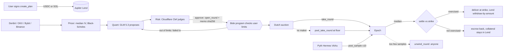

# Bide

**Name the price you want. Get paid until you get it.**

A limit order on Solana earns nothing while it waits. Bide turns "buy SOL at $110" or "sell my SOL at $150" into a series of short, fully collateralised options rounds (cash-secured puts or covered calls). Each round pays the user a premium up front, while the collateral earns Jupiter Lend interest. An AI desk proposes each round, a decision model judges it, and a Solana program enforces the limits the user signed.

Built at TOKEN2049 Origins (Main track + Solana "Best Use of Solana"). **Devnet only. Unaudited.**

- Live app: https://bide-token.vercel.app
- Program: [`4bwTwLAZqPMLSbdvQQ9UrePJiRBUKgiA8TKV3ydo4tqe`](https://explorer.solana.com/address/4bwTwLAZqPMLSbdvQQ9UrePJiRBUKgiA8TKV3ydo4tqe?cluster=devnet) (Solana devnet)
- Technical design: [ARCHITECTURE.md](ARCHITECTURE.md)
- Deck / video: <!-- TODO: deck / video link -->
- Product spec and decision log: [SPEC.md](SPEC.md). Lane notes and devnet logs: [notes/](notes/)

## Try it yourself (devnet, 5 steps)

1. **Wallet.** Phantom → Settings → Developer settings → Testnet mode → Solana **Devnet**.
2. **SOL.** [faucet.solana.com](https://faucet.solana.com) → about 1 devnet SOL for fees and rent.
3. **USDC.** [faucet.circle.com](https://faucet.circle.com) → Solana Devnet → about 20 USDC (mint `4zMMC9srt5Ri5X14GAgXhaHii3GnPAEERYPJgZJDncDU`, the one devnet Jupiter Lend accepts).
4. **Plan.** Open [bide-token.vercel.app/earn](https://bide-token.vercel.app/earn) → **Buy cheaper** → turn on **Quick plan (10-minute rounds)** → Balanced → **$20 or less** → review → sign once. Your USDC goes into Jupiter Lend.
5. **Watch.** `/plan/<id>` shows the round, premium, oracle samples and settlement. `/desk` shows each AI desk run, the Clef scores and the memo hash. `/auctions` shows the tape, each maker's bid and thesis, and maker P&L.

The first round can take **10–20 minutes**: it joins the next 10-minute epoch whose auction window is still open. Keep the size small; the two maker bots hold about 1 WSOL each. If the worker is down, your funds stay in Lend: you can close the plan between rounds, and anyone can expire it after the deadline.

## How it works

| User says | What Bide does |
|---|---|
| "Buy SOL at $110" | Sells cash-secured puts at $110. USDC collateral sits in Jupiter Lend. |
| "Sell my SOL at $150" | Sells covered calls at $150. SOL collateral sits in the Jupiter Lend WSOL market. |
| "Buy at $110, then sell at $150" | Wheel: puts until filled, then `flip_plan`, then calls. |

1. **Plan.** The user signs `create_plan` once: side, target price, size, deadline, minimum yield per day, maximum expiry, rounds per day. Collateral goes into Jupiter Lend by CPI.
2. **Epoch.** Rounds join a shared epoch per asset and expiry. Standard epochs settle at 08:00 UTC. An opt-in, labelled **quick plan** uses 10-minute epochs on the same code path.
3. **Price.** The worker reads option quotes from Deribit, OKX, Bybit and Binance, takes the median implied volatility over at least 2 venues and runs Black-Scholes on Pyth spot. Auction start = fair × 1.3. Floor = median bid × 0.9.
4. **Desk.** The AI Quant proposes a round. Cloudflare Clef approves, adjusts or vetoes it. The keeper sends the proposal to `open_round` as-is. The program checks it against the user's signed limits.
5. **Auction.** A Dutch auction falls from start to floor. The first maker to call `take_round` pays the premium (user gets it at once, minus a 10% fee) and escrows the delivery side. If no maker takes it, a backstop pool can buy at the floor.
6. **Settle.** Ten Pyth prices are posted into ten time buckets, each verified through Wormhole on-chain. The median is the settlement price. If exercised, the user gets SOL at exactly the strike (put) or USDC at exactly the strike (call). If not, both sides get their collateral back and the user keeps the premium. If too few samples land, anyone can unwind.



### AI roles

| Role | Model | Decides | Why this choice |
|---|---|---|---|
| Intake | GLM 5.3 (Z.ai) | Turns a sentence into draft form fields. A "% move" becomes a dollar price in code, from live spot. | Free text is where an LLM beats a form. The model never does the arithmetic. The user still reviews and signs. |
| Quant (desk) | GLM 5.3, 9 tools | Each round: open / skip / flip / stop, which expiry, how much of the goal, auction start and floor (copied from the price grid). | Needs tool calls across prices, calendar, Lend rate and past outcomes. |
| Risk | Cloudflare Clef (Workers AI); GLM fallback | Probabilities for approve / adjust / veto, event risk, data quality, user fit, rationale consistency. | Returns typed probabilities, not prose. It is given no plan bounds. If no risk backend answers, no round opens. |
| Makers ×2 | GLM 5.3 personas ("Event desk", "Momentum desk") | Once per epoch: bid or pass, a discount below fair, a thesis. Code computes the bid and caps it at fair. | Two opposite views make the auction a real contest. Each bid is hashed and stored. If the LLM fails, a labelled deterministic fallback bids. |
| Program | Anchor on Solana | Enforces every limit, holds the money, settles. | Code, not AI, is the referee. |

"The agent is allowed to try; the program decides." The prompt does not forbid out-of-bounds values. A proposal outside the user's limits becomes a public failed transaction.

### Yield, honestly

- **Devnet Jupiter Lend pays ≈ $0** — no borrowers. On-chain exchange rates on 6 Oct 15:40 UTC: USDC `token_exchange_price` 1.010325 (flat vs 5 Oct), WSOL 1.000000 (never accrued).
- **Mainnet Lend pays ≈ 4% APY** (Jupiter API reference). It accrues continuously (the jlToken share price rises), not as a daily payout. In Bide it stays in Lend: `withdraw_collateral` pays only what the counterparty is owed; the interest reaches the user on `close_plan` / `expire_plan`.
- **The premium is the main income.** The daily round [`5Ccf…dpcc`](https://explorer.solana.com/address/5CcfmgSseQNn8jQUWCDpBx1pJLrtzzj5ZLUCNbRydpcc?cluster=devnet) paid ≈ 0.54% of notional (after fee) for ~24 h, vs ≈ 0.011%/day for Lend at 4% APY. Quick (10-minute) rounds pay 0.001–0.12% of notional each.
- **Totals so far** (6 Oct 15:35 UTC): 22 paid rounds, $0.1226 to users after fee, $0.0136 in Bide fees. Live on `/auctions`.

## Evidence (devnet)

All links are Solana Explorer on devnet. Every signature below was re-checked against devnet RPC on 6 Oct 2026. Amounts and context: [notes/integration.md](notes/integration.md), [notes/data-flow-fixes.md](notes/data-flow-fixes.md), [notes/stress-test.md](notes/stress-test.md).

| Path | Context | Transactions |
|---|---|---|
| Buy (put), not exercised | quick put, K $121.20, 0.0125 SOL, 5 Oct | `create_plan` [41WtQaeb…](https://explorer.solana.com/tx/41WtQaebPKztQExzAFCq7f5eeFyBXoXRJwLjQsChGkwr6ed2otfpQcD6DTKZW3xK5GuPj9fQiENNkdfbCPtf8g6N?cluster=devnet) · `take_round` [nkoGJCxT…](https://explorer.solana.com/tx/nkoGJCxTdwunFCU3vxyvDFX6LDdEq3qNvLfiaGjtWa6SfqrywLGnfwr1zDpnR6ake3tw7xsoExTpuDDALqTN1NW?cluster=devnet) · `post_sample` b0 [4Nob266i…](https://explorer.solana.com/tx/4Nob266iCtnGmCmgkrN7nbgAkaPmLYejNdgKxBzQAyT1c1BE5J777CLMmfEThRSngzRGPUM2L4A6YfG5t65cwzhQ?cluster=devnet) … b9 [33oZh48P…](https://explorer.solana.com/tx/33oZh48PYc4ermytFnyV7quaj9VGn5iFHC6Gb69mHQxJQPWY5bt5RBJ6a9RuoutyfakJVokMhcmTsfLpgm4apoX4?cluster=devnet) · `resolve_epoch` [bMoEwkqE…](https://explorer.solana.com/tx/bMoEwkqEf4gFeaefYegQ2HzpvSULKigBcQL4csgez7ay9EL8muYi3JX7pFjwqNp7BYTQjXgdYVSWyu6b1sd7udf?cluster=devnet) · `resolve_round` [3jQKNg51…](https://explorer.solana.com/tx/3jQKNg51Akn7edp94VCQ2S9et1eKdQt5cH9QV6v49VMfZ7rgVkM9DWKsYquqGpPwdLXLCg34e8qNKvePcVbU1PxC?cluster=devnet) |
| Buy (put), exercised + `withdraw_collateral` | K $121.20, ITM on purpose, 6 Oct | `take_round` [5beCsBj8…](https://explorer.solana.com/tx/5beCsBj8s7bBS6pBxqrA4ihB9ZjREgH99AvpuUwM9dXT8D5mzki2frKscrq5CfS3mQv1S9kc8Yd3VU1wHKegmaGM?cluster=devnet) · `resolve_epoch` [3caxotM5…](https://explorer.solana.com/tx/3caxotM5WVqLJfo2sgvCQVrr4YxT9bWnhLG5HzPJkGRc2TSDBQDGRMjXAcr5dq5jyxs3iVKePecExhV7yk1XfAKT?cluster=devnet) · `resolve_round` (user +0.0125 WSOL) [4FZPoj96…](https://explorer.solana.com/tx/4FZPoj962qUwp2YfD9fm7pvBcRct4MZes1iMmqqrKdA5eDC8JjnsgcZ7twp8Hs6hN1cZ7N69KdamhTsycsMw2Hk2?cluster=devnet) · `withdraw_collateral` (maker +1.515 USDC = K×Q) [3zDjRmTQ…](https://explorer.solana.com/tx/3zDjRmTQBxon7ExDGUma7CTyxgjwswJGvgKJqd9of3euCkbTzC6M8PQM6j9Q8YSnUid4UHKWoX2sBoXh3BMt12ju?cluster=devnet) |
| Sell (call), not exercised | K $121.00, 6 Oct | `create_plan` (SOL → Lend) [5gmz6ktG…](https://explorer.solana.com/tx/5gmz6ktGrr5N6goABsvH1JRb4HWtNYA71cd3Pc7foMD9uCw3xi36HAbibjZzmn15t6KdodyrBKsrdDUgfZDLqRR9?cluster=devnet) · `take_round` [iheCru8v…](https://explorer.solana.com/tx/iheCru8vSqSbd4VxtkxdEtzuNeN69dUBLZALqSYsZWeSqSLPYEeXtJ2sjaeYxkkue9PnJyYb8itB12jNbi37fTU?cluster=devnet) · `resolve_epoch` [3Es39WAF…](https://explorer.solana.com/tx/3Es39WAF3QC6BFSZdahZ8xsdW2dgaZV4ztf5DP8dTdpn9epfRkBnw2d3G97nVNLuowk6VQV13yUUEKpmXgyy4nkw?cluster=devnet) · `resolve_round` [5UE1dpT7…](https://explorer.solana.com/tx/5UE1dpT7CxamH4CZhuzjqF5sQFRKoqS7KRA8RjweBMfoAsqxe21WyAt47CoFAaJu7JqMwHuy8y4zVoKm5zhcUh8i?cluster=devnet) |
| Sell (call), exercised + `withdraw_collateral` | K $119.90, ITM on purpose, 6 Oct | `open_round` [Mft1nqxG…](https://explorer.solana.com/tx/Mft1nqxGoWPvDfCGcGr4tr3A1xhhSEkqY4zp6VGqExayR7RTNh8cj5iws95eGsB29wsfRDjkffmJ6Uv4Ped8cjY?cluster=devnet) · `take_round` [5pU5CPH4…](https://explorer.solana.com/tx/5pU5CPH4ksMBhkN5F8gVutJLXHsgYBBzc94c6S5jVHt5urVEkGPWn67NX7JvwEjizkhidxQM7KqaipLHPCT5UhJN?cluster=devnet) · `resolve_epoch` [2XqQEQSD…](https://explorer.solana.com/tx/2XqQEQSDTmE5HKLqqDHe5Xi3hCQLvkYqHopyQ8hhojL25WCKKAVKrQ6hs9buRVth5GSFFXHBhm6pg1Ra19Zauprh?cluster=devnet) · `resolve_round` (user +1.49875 USDC) [4StRsnxi…](https://explorer.solana.com/tx/4StRsnxiG8L4X2F1QFNjCBhMm8WDsTJwJJ8doLuiCoiyHBpcUAL3EMi2VGKRXCMUqYP1R3KJVj28AZKNtSduDC1M?cluster=devnet) · `withdraw_collateral` (maker +0.0125 WSOL) [2opnRpAm…](https://explorer.solana.com/tx/2opnRpAm1GNzCcFUDZvSLfzNiuNvrKKH1pJeHrJ3CsAb4T1QxDxHALgwAxXBqnK6TQjGzcsU5R71D6fkbx8Uh6hu?cluster=devnet) |
| Desk-opened round, exercised | put K $120.00, Clef approve 0.65, memo `501c163a…`, 6 Oct 06:00 UTC | `open_round` by the desk [UjwADizX…](https://explorer.solana.com/tx/UjwADizXDp4BCaEGfRYZzftiGmVJop2XYpZX1H31k11aNdtJoHDnLvB5eZDnBXzMnED5Kk6Hm1mF71TDmcvn9SE?cluster=devnet) · `take_round` maker-2 [3MCrc3ys…](https://explorer.solana.com/tx/3MCrc3ys7hwkkZRurK8pCebjjTgmNNFh511S3PsoGyX5eXvGKt8imaVDr7mv1GfBiiywD11tbHzL6iuzvy5n3Q8W?cluster=devnet) · `resolve_epoch` [5eBhg6Um…](https://explorer.solana.com/tx/5eBhg6UmvhbbqpLJCvKGWwi451DofKUiJfzENmiQSaoEF7sR9CMmmgGVUwXRTCEug31NZLpTC7TxTvP7JVgRfq5J?cluster=devnet) · `resolve_round` [3fPudv5k…](https://explorer.solana.com/tx/3fPudv5k1cs1JnCjDEVCzeatzpdq68nPGgx2duMLReYoGMSq6vKUqK5whgUmomvLBmpeeGjmHcnQt2EXpzYEz5Gw?cluster=devnet) · `withdraw_collateral` [46W4wB9J…](https://explorer.solana.com/tx/46W4wB9JjnLaNte8fGsEXcJ42gQAh5fax1vLzyFEvcd8skyX27WmsiR9D3tzmR13FhxLe9NXaBYr5BLvHJS2dmdX?cluster=devnet) |
| Desk-opened round, not exercised | put K $120.00, 6 Oct 05:20 UTC | `open_round` [2J7UdhYk…](https://explorer.solana.com/tx/2J7UdhYkLEgQnCAYo7cuLGz28atQLneQWkUXBZZs74cnGEYnkgqLTRPzBNSCfXyo3RzcG5xSQ55LPpPoeLRj6tn2?cluster=devnet) · `resolve_epoch` [iK3evfsJ…](https://explorer.solana.com/tx/iK3evfsJMScy24wX7vaHUepwJSE91XFYpMi4jc8zfZnNcjNxHbtJhgZc3JfnntWixL4W3cPa7AnCEWLNe6vcYJo?cluster=devnet) · `resolve_round` [Ahajta7L…](https://explorer.solana.com/tx/Ahajta7LZukbuW15cBW7EJ45kisJxHkM2sNbyMae5ctqmUqQgzJfy3rxKDV5Kw1tx9j6a1i5Bm99Gv2QkofFzip?cluster=devnet) |
| Pool takes (no maker bid) | backstop pool `3vY4n9Wm…`, 6 Oct 12:50–13:01 UTC | `pool_take_round` [4pZ6nNd3…](https://explorer.solana.com/tx/4pZ6nNd3wEgrydPzUEmZjceWscZngEqTumQgtsQaY3bLkRF8F1KW5hYkcmyP3qRuQVVruVdj6vhnCDHjZrtdrNvG?cluster=devnet), [5ZZhmRwo…](https://explorer.solana.com/tx/5ZZhmRwoJWRUTT7Qh7GGZdDA13QtHtWwXRsNDfW4bZESoHkbQ5F32iSnm19S5CRx6q2TV5LiSeXgmVhm2qiRrtaU?cluster=devnet), [5gDwvony…](https://explorer.solana.com/tx/5gDwvonyQQ4WPUaBBMEN4rjwdCJjV2HxuZRpeazKZGio4jcx6WyNBA3Vk4bXWp33xy4Va6xACpqxrSGh4pYcGaFE?cluster=devnet) · first pool round's `resolve_round` [28W8VQLC…](https://explorer.solana.com/tx/28W8VQLCfawNampfDzRt3NvJW5tKQVCbsgAYaiEaNonDGA2kEqmNvaBQXTYUJ1uzbiqKBc8MpHvdR3nQXpWkvE2X?cluster=devnet) |
| `unwind_round` (epoch Failed) | 5 Oct: keeper hung on one RPC call and missed every sample | `take_round` [V6wCdKUh…](https://explorer.solana.com/tx/V6wCdKUhurDk5jZpgJ4FEy2DbcsefiWTu9r2xNJRvDbcbwbZNuuHycEYU6ydQaWAsjE91ZH12DY4SkpcFBESidX?cluster=devnet) · `unwind_round` [q27k3UEX…](https://explorer.solana.com/tx/q27k3UEXBsJcoRMkyy8PPL74Pg3ZfQJgoRDeDbgQUa6y1P9ZcLvgbPUAJTFMFS13KJNwBo8Yf52jYtrbbw5wwxG?cluster=devnet) |
| `expire_plan` after deadline | sell plan `9AJ9QTKU…` | [2HbKYmv2…](https://explorer.solana.com/tx/2HbKYmv2GRfLaxaZZnMypGRheft8kAcJ395k8SH8P7A3MjABXyKQQUhSq8LaeEMSVExKvnfwUzky86SVKVZZMUma?cluster=devnet) |
| No taker → `cancel_round` | std put round, 6 Oct 08:08 UTC (feed stale, no pool yet) | [2zDjcYRW…](https://explorer.solana.com/tx/2zDjcYRWgTGE4XhtPRkawEc5tpx4mDavp36p7o4JYbJuxE9Um2XEXbKw4qEUUKgDHeXPsSVhfVvPtonsNAJhBEHX?cluster=devnet) |
| **Live std round** | call `5CcfmgSs…`, K $121.10, opened by the AI desk, taken by maker-2. Samples 7 Oct 07:30–08:00, **settles 7 Oct 08:00 UTC** (not settled at time of writing). | `open_round` [3rVN2AQR…](https://explorer.solana.com/tx/3rVN2AQRcYBpXPpNgWfPRM6xxWHJmXrrELFbdHZVtEKfdz8dRRTn7orqwwbprWD97gn4HGevbuNhavH6LvYqN4Ps?cluster=devnet) · `take_round` [kPKLj9Ju…](https://explorer.solana.com/tx/kPKLj9JuHqquLgdDCLod9swoExxkSWmfYMjuAnypatFm2HszLARTSjHJ4EAQMjvKXwDuu6zKbzrCbFt8afn9AdF?cluster=devnet) |

**On-chain rejections (real failed transactions, error code in the logs):**

| Error | What happened | Tx |
|---|---|---|
| `AuctionParamsInvalid` (6014) | The desk proposed a 300 s auction on a quick round. Quick allows 5–120 s. This is the one genuine bound rejection so far. | [4gmtb3Mf…](https://explorer.solana.com/tx/4gmtb3MfKeA19tAnbsumAyUCb16mpYwWpqLuvhkVpStQrBkC1qXcTaiSCSpRxc8ifTbJiNyRHHSz1SRU8Nt3DqCh?cluster=devnet) |
| `OutsideAuctionWindow` (6001) | Timing, not a bound: the desk finished after the 60 s quick window closed. | [SB5ikbYN…](https://explorer.solana.com/tx/SB5ikbYN7hFYpFLLLi53ytScFaHLkQNHLGt2cBiYJGpH45Q5vw6sopGUhX8mvqBEqQi1gHSHWbDh6rq459rid9h?cluster=devnet), [27kgrFqb…](https://explorer.solana.com/tx/27kgrFqbrFaeMDNrzoFnYcNtj2EHvwdNZ9Tc7KMt6Z4RJ7QRKDLcUVh8E1P55eURLBsnrzb8YgHsjWtEwq2ZZpHs?cluster=devnet) |
| `StalePrice` (6020) | Timing: the devnet push feed was 320 s old (manual script). | [2qnnSmxh…](https://explorer.solana.com/tx/2qnnSmxhstv8KW3cice6aD64Jnf2H5Qwur1cfYufdBEHdwdkpZNf6ES7kgXtBWUu22oNL9bZgkgLv8e8nn5uQGbZ?cluster=devnet) |

No strike, size, expiry or minimum-yield rejection has happened yet.

**Stress test (6 Oct, [notes/stress-test.md](notes/stress-test.md)):** after the queue and timing fixes went live at 12:41 UTC, 4 of 4 quick slots opened and were taken (1 by a maker, 3 by the pool). After quick rounds were priced from the auction-window open (deployed 14:31 UTC), the next 3 rounds were all taken by the AI maker agents (LLM bids), none by the pool. Before the fixes, about 2 of 3 slots were lost to missed windows and Clef vetoes.

## Tech stack

| Layer | Choice | Why |
|---|---|---|
| Program | Anchor 1.0.2, Rust 1.89 | One program holds collateral, runs auctions and settles. |
| Yield | Jupiter Lend Earn, CPI | Idle collateral earns interest between rounds. |
| Oracle | Pyth (Hermes VAAs + push feed), Wormhole verification | Full-verified samples on-chain; nobody can pick among prints. |
| Worker | Node 25, TypeScript, Hono, pm2 on a VM | Long-running loops: pricer, keeper, sampler, makers. |
| AI | GLM 5.3 (Z.ai), Cloudflare Clef (Workers AI) | Tool-calling planner plus a probability-scoring judge. |
| App | Next.js 16, React 19, Tailwind 4, Phantom/Solflare | Hosted on Vercel. v0 transactions with a Lend lookup table. |
| Data | Supabase Postgres, row-level security | Desk runs, rounds, bids for the UI. Chain is the source of truth. |
| Tests | LiteSVM against real devnet binaries; node:test | The program is clock-gated; LiteSVM can set the clock. |

## Repo layout

```
programs/bide/src/     Anchor program: state, errors, math, oracle, lend (Jupiter CPI), instructions/
packages/shared/       IDL, BideClient instruction builders, PDAs, constants
tests/src/             LiteSVM tests on dumped devnet binaries (fixtures gitignored)
worker/src/            pricer, keeper, sampler, makers, mirror, desk (Quant/Risk/memo), agents, chain, pyth, db, http
app/                   Next.js app: / /earn /plan/[id] /plans /desk /auctions /maker /pool, Blink route
scripts/               devnet init, lookup table, pool, manual round opener, Pyth posting and checks
supabase/migrations/   schema and RLS
notes/ docs/           lane notes, devnet logs, AI design, pitch
```

## Run locally

Prerequisites: Node 25, pnpm 11, Rust 1.89, Anchor CLI 1.0.2, solana-cli, a devnet wallet with SOL and Circle devnet USDC.

Environment variable **names** (copy `.env.example` and `app/.env.example`; never commit values):

- Worker / scripts: `HELIUS_RPC_URL`, `PROGRAM_ID`, `USDC_MINT`, `KEEPER_KEYPAIR`, `MAKER1_KEYPAIR`, `MAKER2_KEYPAIR`, `PYTH_HERMES_API_KEY`, `JUP_API_KEY`, `ZAI_API_KEY`, `ZAI_BASE_URL`, `ZAI_MODEL_MAIN`, `CF_ACCOUNT_ID`, `CF_AI_TOKEN`, `RISK_BACKEND`, `SUPABASE_URL`, `SUPABASE_SERVICE_KEY`, `WORKER_SHARED_SECRET`, `QUICK_PLANS_ENABLED`, optional `HOST`, `PORT`, `MAKER_LLM`, `MAKER_STANCE_LEAD_SECS`, `INTAKE_ENABLED`
- App: `NEXT_PUBLIC_RPC_URL`, `NEXT_PUBLIC_SUPABASE_URL`, `NEXT_PUBLIC_SUPABASE_ANON_KEY`, `NEXT_PUBLIC_PROGRAM_ID`, `NEXT_PUBLIC_LEND_ALT`, `NEXT_PUBLIC_QUICK_PLANS_ENABLED`, `NEXT_PUBLIC_MAKER_BOTS`, `WORKER_URL`, `WORKER_SHARED_SECRET`, `HELIUS_RPC_URL`

```bash
pnpm install
pnpm build:program                   # anchor build
scripts/dump-fixtures.sh             # once: dump devnet programs and accounts for LiteSVM
pnpm test:program                    # 28 LiteSVM tests
pnpm --filter @bide/worker test      # 196 worker tests
pnpm worker                          # all worker loops + HTTP on 127.0.0.1:8787
pnpm app                             # Next.js on http://localhost:3000
```

Apply the three migrations in `supabase/migrations/` before starting the worker; without them it falls back to an in-memory store and logs it. Without Z.ai or Cloudflare keys the desk fails closed (no rounds) and makers use the deterministic fallback. Run only one keeper at a time. VM deployment: [worker/DEPLOY.md](worker/DEPLOY.md).

## Honest limits

- **Devnet only, unaudited.** An audit is needed before real money.
- **The other side is mostly us.** The two maker agents and the only pool deposit (25 USDC + 0.5 WSOL) are ours. They use the same public instructions anyone can call. The `/pool` deposit button is not wired in the app; deposits go through `scripts/init-pool.ts`.
- **The pool is unhedged** and probably loses on average. Its caps limit the damage: premium at most 1.5% of notional, 40 USDC open notional, 50% utilisation, 2 USDC spend per 24 h.
- **Quick-plan pricing is approximate and labelled.** No venue lists 10-minute options, so quick rounds use the nearest listed expiry's IV (flat). Quick premiums are cents.
- **Devnet spot can be up to 300 s old** (`max_spot_age_secs` 300, raised from 180 after a 227 s feed gap). This makes the open/take spot-move guard much weaker than it would be on mainnet.
- **AI latency and vetoes cost rounds.** Desk runs take about 50–100 s on one serial GLM queue and one Z.ai key. Clef vetoed about half of proposals on 6 Oct, mostly "rationale does not match the tool numbers"; a fix shipped at 12:41 UTC but its effect on the veto rate is not yet measured. A Z.ai outage means no new rounds; there is no deterministic opener.
- **No user-bound rejection yet.** The program checks strike, size, expiry and minimum yield, and LiteSVM tests cover those rejections. On devnet the AI has only been rejected on auction length and timing.
- **The worker is a liveness dependency.** Rounds are not opened or sampled while it is down. Funds never get stuck: settlement, unwind, expire and cancel are permissionless.
- **Small inventory.** Maker bots hold about 1 WSOL and 40–50 USDC each; keep plans at $20 or less.
- **History starts 6 Oct ~06:11 UTC.** Earlier rounds ran on a laptop with an in-memory store; they are on-chain (above) but not on `/desk` or `/auctions`.
- **Regulation.** Selling options to retail users needs legal advice (MAS and others) and likely geo-blocking before any launch.

## Security reviews and mainnet gates

Two external-style adversarial reviews ran on 6 Oct 2026, after an earlier Fable 5.1 review.
- **Fixed and deployed (devnet slot 508146124):** every program-owned vault and settlement destination is bound to its canonical address (pool deposit/withdraw/lend/take, plan close/expire/update/flip, resolve/unwind/withdraw); `post_sample` rejects updates from the future; collateral shortfalls are logged. 6 new attack tests (34/34 program tests). Worker/app: makers re-price instead of giving up, stale Pyth spot is refused, maker P&L sign fixed, auth on desk-run reads, `/maker` keeps last good data.
- **Before mainnet (not fixed on devnet, by design):** atomic deploy + `init_config` (front-run risk); upgrade and pool authority to a multisig; timelock/allowlist on admin oracle and fee changes; refund the premium when an epoch fails and the round unwinds; sanity bounds on Jupiter Lend layout reads and validation of every Lend market account; a formal audit.

## Pre-existing work

None. Only planning documents (no code) existed before the hackathon kickoff on 4 Oct 2026. All code was written during TOKEN2049 Origins; see `git log`.
